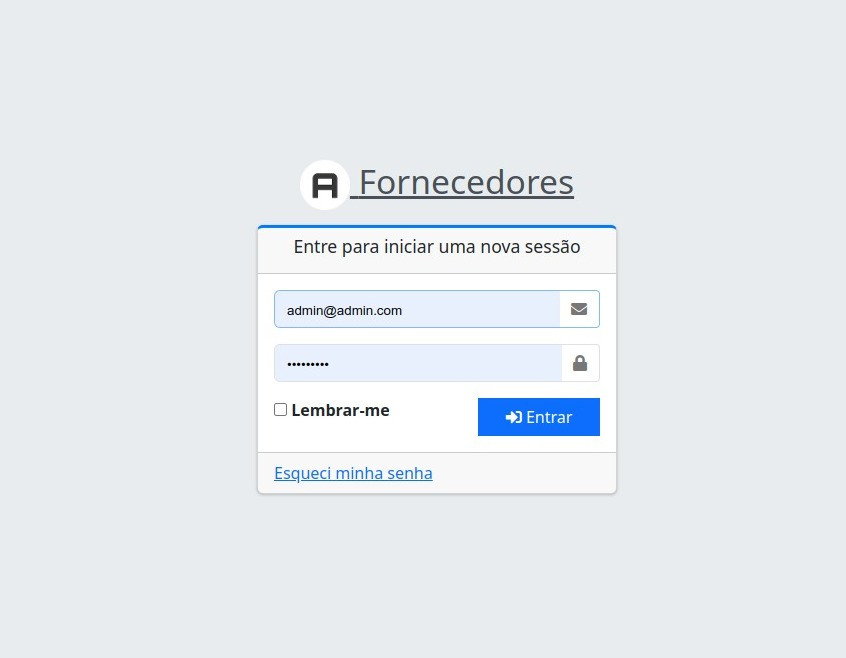
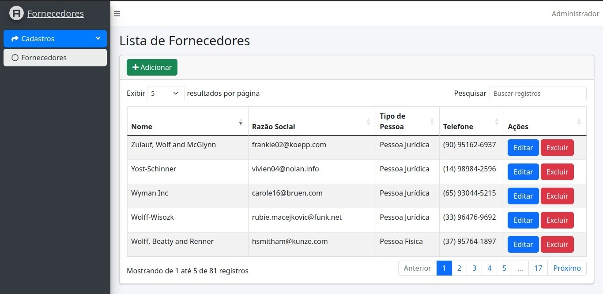
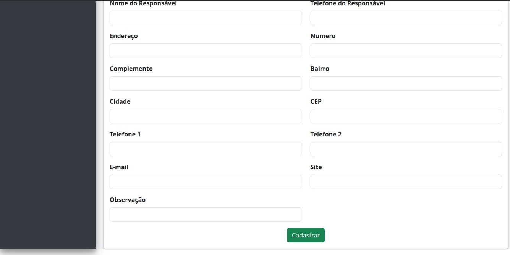
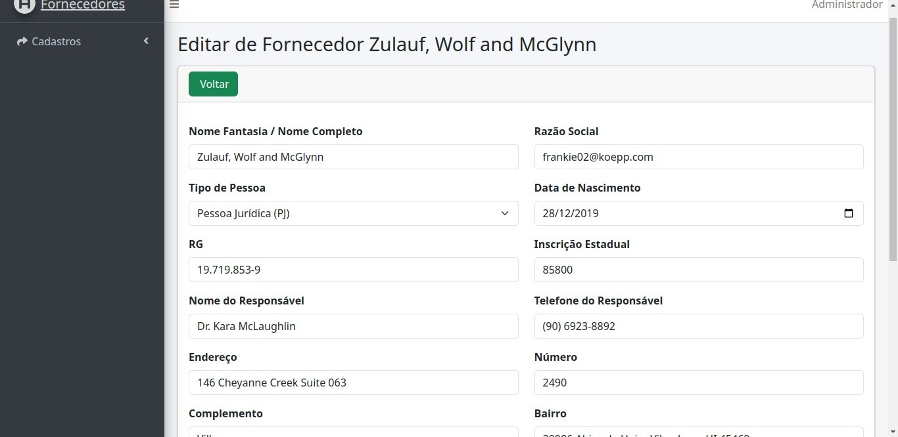
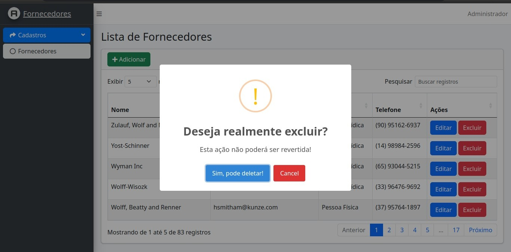
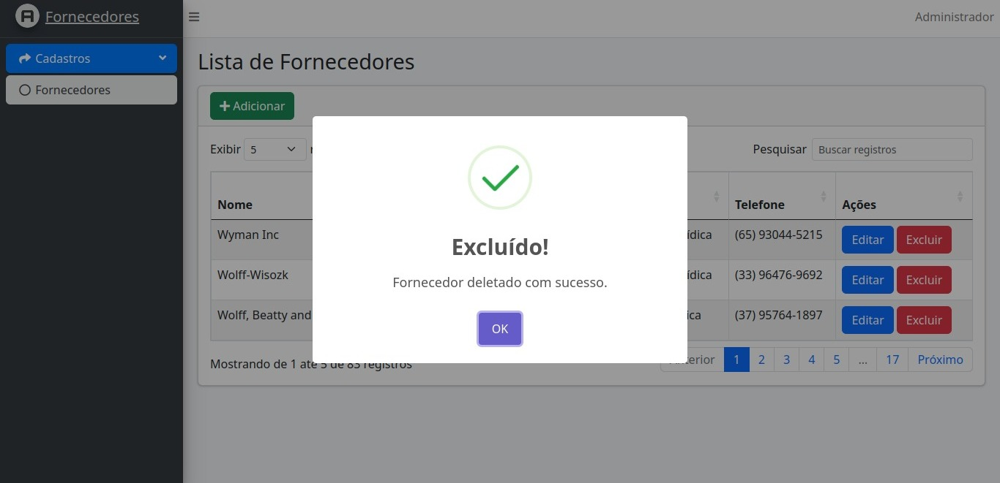

# Projeto de Cadastro de Fornecedores com Laravel 10

Este é um projeto desenvolvido com Laravel 10 para a gestão de fornecedores. Ele inclui as funcionalidades de criação, leitura, atualização e exclusão (CRUD) de fornecedores, bem como validações e seeders para preencher o banco de dados com dados de exemplo. O Docker Sail é usado para simplificar o ambiente de desenvolvimento.

## Print das Telas












## Requisitos

Antes de começar a usar este projeto, certifique-se de ter as seguintes dependências instaladas em sua máquina:

- PHP 8.0 ou superior
- Composer
- Docker
- Docker Compose

## Configuração

Siga estas etapas para configurar o projeto em sua máquina:

1. Clone este repositório para o seu ambiente de desenvolvimento:

   ```bash
   git clone https://github.com/leabru29/cadastro-fornecedores.git
2. Acesse o diretório do projeto:

   ```bash
   cd cadastro-fornecedores
3. Copie o arquivo .env.example para .env e configure o banco:

   ```bash
   cp .env.example .env
4. Inicialize o ambiente Sail e inicie os contêineres Docker:

   ```bash
   ./vendor/bin/sail up -d
5. Rode o Npm :

   ```bash
   ./vendor/bin/sail npm install && npm run dev
6. Rode as migrations e os Seeders com:
    ```bash
    ./vendor/bin/sail artisan migrate:fresh --seed
7. Acesse o Login com:
    ```bash
    admin@admin.com
8. A senha coloque:
    ```bash
    123123123
9. O projeto estará disponível em `http://localhost`. Acesse-o em seu navegador.

## Funcionalidades

- **Cadastro de Fornecedores**: Você pode criar novos fornecedores fornecendo informações como nome, endereço, telefone, e-mail, etc.

- **Listagem de Fornecedores**: Visualize a lista de fornecedores cadastrados com opções de edição e exclusão.

- **Edição de Fornecedores**: Atualize as informações de fornecedores existentes.

- **Exclusão de Fornecedores**: Remova fornecedores da lista.

- **Validação de Dados**: O sistema possui validações para garantir que os dados estejam corretos antes de serem salvos no banco de dados.

## Tecnologias Utilizadas

- Laravel 10
- Docker Sail
- MySQL
- Redis
- Blade (para as views)
- Eloquent (para o mapeamento objeto-relacional)

## Contribuição

Se desejar contribuir para este projeto, sinta-se à vontade para abrir problemas (issues) ou enviar solicitações de pull (pull requests). Estamos abertos a melhorias e feedback da comunidade.

## Licença

Este projeto é licenciado sob a [Licença MIT](LICENSE). Sinta-se à vontade para usá-lo e modificá-lo de acordo com suas necessidades.

## Autor

- Leandro
- E-mail: leandro_ccb10@hotmail.com

## Agradecimentos

Agradecemos por escolher este projeto como base para o seu trabalho. Esperamos que seja útil e que você tenha uma ótima experiência desenvolvendo com o Laravel 10 e o Docker Sail.

---
